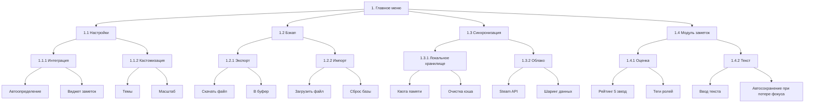

```mermaid
graph TD
Root[1. Главное меню Popup-окно / Интегрированный UI] --> L2_1[1.1. Настройки Settings]
Root --> L2_2[1.2. Бэкап Backup Manager]
Root --> L2_3[1.3. Синхронизация Data Sync]
Root --> L2_4[1.4. Модуль управления заметками Core Engine]
L2_1 --> 111[1.1.1. Модуль FACEIT интеграции]
111 --> 1111[1.1.1.1. Переключатель автоопределения матча]
111 --> 1112[1.1.1.2. Тумблер отображения блока заметок на Steam/FACEIT]
L2_1 --> 112[1.1.2. Интерфейс и Кастомизация]
112 --> 1121[1.1.2.1. Выбор цветовой схемы Dark/Light]
112 --> 1122[1.1.2.2. Настройка масштаба UI-визуализации заметок]
L2_2 --> 121[1.2.1. Экспорт локальных данных]
121 --> 1211[1.2.1.1. Кнопка Скачать JSON-файл Скачивание локальной БД заметок]
121 --> 1212[1.2.1.2. Кнопка Скопировать в буфер Текстовый зашифрованный дамп]
L2_2 --> 122[1.2.2. Импорт сохраненных данных]
122 --> 1221[1.2.2.1. Область загрузки файла Drag and Drop .json]
122 --> 1222[1.2.2.2. Кнопка Очистить текущую БД Сброс перед импортом]
L2_3 --> 131[1.3.1. Локальное хранилище Firefox Browser Storage]
131 --> 1311[1.3.1.1. Индикатор заполненности квоты памяти в Кб]
131 --> 1312[1.3.1.2. Опция ручной очистки кэша неактивных игроков]
L2_3 --> 132[1.3.2. Внешнее облако Комьюнити-синхронизация — Future MVP]
132 --> 1321[1.3.2.1. Поле ввода API-токена / Авторизация через Steam]
132 --> 1322[1.3.2.2. Переключатель шаринга Делиться своими оценками с другими]
L2_4 --> 141[1.4.1. Система оценки игрока Rating]
141 --> 1411[1.4.1.1. Интерактивная 5-звездочная шкала рейтинга]
141 --> 1412[1.4.1.2. Выбор тега роли токсик, лидер, опорник, AWPer]
L2_4 --> 142[1.4.2. Текстовый блок комментариев]
142 --> 1421[1.4.2.1. Поле ввода текста Пользовательские наблюдения]
142 --> 1422[1.4.2.2. Автоматическое сохранение при потере фокуса OnBlur]
```

```mermaid
graph TD
Root[1. Главное меню] --> L2_1[1.1 Настройки]
Root --> L2_2[1.2 Бэкап]
Root --> L2_3[1.3 Синхронизация]
Root --> L2_4[1.4 Модуль заметок]
L2_1 --> 111[1.1.1 Интеграция]
L2_1 --> 112[1.1.2 Кастомизация]
111 --> 1111[Автоопределение]
111 --> 1112[Виджет заметок]
112 --> 1121[Темы]
112 --> 1122[Масштаб]
L2_2 --> 121[1.2.1 Экспорт]
L2_2 --> 122[1.2.2 Импорт]
121 --> 1211[Скачать файл]
121 --> 1212[В буфер]
122 --> 1221[Загрузить файл]
122 --> 1222[Сброс базы]
L2_3 --> 131[1.3.1 Локальное хранилище]
L2_3 --> 132[1.3.2 Облако]
131 --> 1311[Квота памяти]
131 --> 1312[Очистка кэша]
132 --> 1321[Steam API]
132 --> 1322[Шаринг данных]
L2_4 --> 141[1.4.1 Оценка]
L2_4 --> 142[1.4.2 Текст]
141 --> 1411[Рейтинг 5 звезд]
141 --> 1412[Теги ролей]
142 --> 1421[Ввод текста]
142 --> 1422[Автосохранение при потере фокуса]
```
